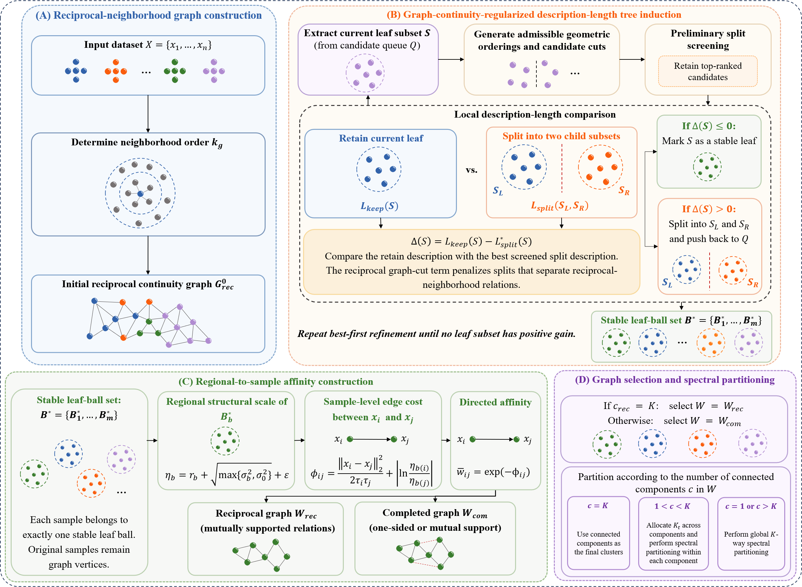

# MDL-GBTRSC

> **Minimum Description Length based Granular-Ball Tree Regularization for Spectral Clustering**

MDL-GBTRSC is a fixed-\(K\) spectral clustering method that uses a description-length-driven granular-ball hierarchy to regularize the **original sample-level affinity graph**. The granular balls are not used as graph nodes or clustering representatives. Instead, stable leaf balls provide regional structural scales that are transferred back to sample-to-sample affinities before the final spectral partition.

---

## Framework

<p align="center">
  
</p>

<p align="center">
  <em>Figure 1. Framework of MDL-GBTRSC.</em>
</p>

---

## Overview

Spectral clustering can recover non-convex structures, but its performance depends strongly on how the affinity graph is constructed. A single global neighborhood or kernel scale may be inadequate when local density, geometric spread, or connectivity varies across the data.

MDL-GBTRSC introduces a granular-ball hierarchy as a regional structural description of the sample space. A local description-length criterion determines whether a current ball should be retained or refined. Reciprocal graph continuity is incorporated into this decision so that a candidate split is penalized when it cuts reliable local neighborhood relations.

After the hierarchy stabilizes, each terminal granular ball provides a local structural scale derived from its radius and effective variance. These scales regularize the affinities between the original samples. The resulting graph is then partitioned according to its connected-component structure and the prescribed number of clusters \(K\).

The method therefore combines three levels of information:

- **Sample-level proximity**, captured by locally scaled neighborhood affinities.
- **Neighborhood continuity**, introduced through the reciprocal preliminary graph during hierarchy construction.
- **Regional structural scale**, supplied by stable granular-ball leaves and transferred back to sample-level affinities.

---

## Main Idea

For a current granular ball \(B\), MDL-GBTRSC compares two local explanations:

1. **Retain** the current ball as a terminal region.
2. **Refine** the ball into two child balls.

The refinement is accepted only when the reduction in local description length is sufficient to compensate for the continuity cost induced by cutting reciprocal neighborhood relations.

The hierarchy is built recursively until no admissible local refinement yields a positive gain. The resulting stable leaves are then used only to estimate regional scales; all observations remain vertices of the final graph.

---

## Citation

```bibtex
@article{xian2026mdlgbtrsc,
  title={Minimum Description Length based Granular-Ball Tree Regularization for Spectral Clustering},
  author={Xian, Zeqiang and Liu, Caihui and Zhang, Yong and Qiu, Wenjing},
  journal={arXiv preprint arXiv:2605.22410},
  year={2026}
}
```

---

## License

This repository is released for academic research. The license information will be updated after publication.

---

## Related MDL Granular-Ball Works

MDL-GBTRSC is part of an ongoing line of research on MDL-based granular-ball learning.

1. **MDL-GBG: A Non-parametric and Interpretable Granular-Ball Generation Method for Clustering**  
   Zeqiang Xian, Caihui Liu, Yong Zhang, Wenjing Qiu, Duoqian Miao, Witold Pedrycz  
   <https://doi.org/10.48550/arXiv.2605.08759>

2. **A Boundary-Aware Non-parametric Granular-Ball Classifier Based on Minimum Description Length**  
   Zeqiang Xian, Caihui Liu, Yong Zhang, Wenjing Qiu, Duoqian Miao, Witold Pedrycz  
   <https://doi.org/10.48550/arXiv.2605.11406>

Researchers interested in interpretable, non-parametric, and MDL-based granular-ball learning are welcome to follow this research direction and discuss related ideas.

---

## Contact

```text
Zeqiang Xian
Gannan Normal University
Email: xianzeqiang@gnnu.edu.cn
```

```text
Caihui Liu
Gannan Normal University
Email: liucaihui@gnnu.edu.cn
```
